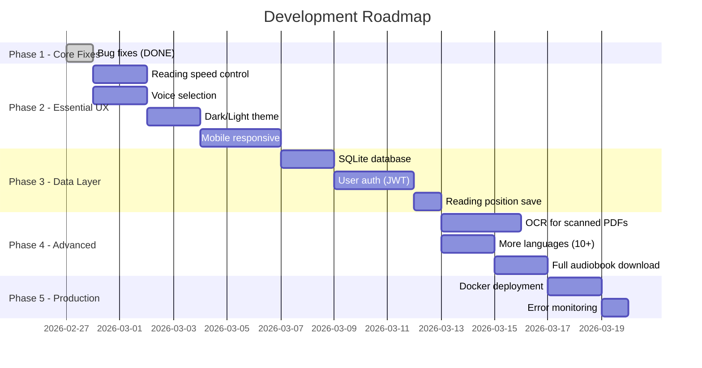

# 🔬 Deep Analysis — Multilingual PDF Reader

## Overview

This analysis covers all **limitations**, **better library replacements**, and **industry-level feature recommendations** for transforming this project from a solid prototype into a production-grade product.

---

## 🚨 Current Limitations

### Architecture & Backend

| # | Limitation | Impact | Where |
|---|---|---|---|
| 1 | **In-memory session store** — sessions lost on server restart | Data loss | [generateController.js](file:///d:/Pabitra%20ROADMAP/You_tube/game4_react/project_6/server/controllers/generateController.js) |
| 2 | **No authentication** — anyone can access any session | Security | Entire backend |
| 3 | **No rate limiting** — vulnerable to API abuse | Stability | [server.js](file:///d:/Pabitra%20ROADMAP/You_tube/game4_react/project_6/server/server.js) |
| 4 | **Single-threaded TTS** — generates chunks sequentially | Performance | [generateController.js](file:///d:/Pabitra%20ROADMAP/You_tube/game4_react/project_6/server/controllers/generateController.js) |
| 5 | **No WebSocket** — uses SSE (unidirectional only) | Scalability | [streamRead()](file:///d:/Pabitra%20ROADMAP/You_tube/game4_react/project_6/server/controllers/generateController.js#125-259) |
| 6 | **Audio files never cleaned** until session expires (2 hrs) | Disk usage | [generateController.js](file:///d:/Pabitra%20ROADMAP/You_tube/game4_react/project_6/server/controllers/generateController.js) |
| 7 | **No error recovery** — if a chunk fails, the gap is permanent | Reliability | [streamRead()](file:///d:/Pabitra%20ROADMAP/You_tube/game4_react/project_6/server/controllers/generateController.js#125-259) |
| 8 | **No concurrency control** — parallel streams on same session can conflict | Data integrity | `activeStreams` |

### Frontend

| # | Limitation | Impact | Where |
|---|---|---|---|
| 9 | **No state management** — all state in [App.jsx](file:///d:/Pabitra%20ROADMAP/You_tube/game4_react/project_6/src/App.jsx) (prop drilling) | Maintainability | [App.jsx](file:///d:/Pabitra%20ROADMAP/You_tube/game4_react/project_6/src/App.jsx) |
| 10 | **PDFs only extractable if text-based** — scanned PDFs fail silently | Feature gap | [UploadSection.jsx](file:///d:/Pabitra%20ROADMAP/You_tube/game4_react/project_6/src/components/UploadSection.jsx) |
| 11 | **No reading position persistence** — refreshing loses progress | UX | All |
| 12 | **Word highlight desyncs** on translated text (word count changes) | Accuracy | [useWordHighlight.js](file:///d:/Pabitra%20ROADMAP/You_tube/game4_react/project_6/src/hooks/useWordHighlight.js) |
| 13 | **No volume or speed controls** — user can't adjust playback | UX | Missing feature |
| 14 | **Mobile layout untested** — no touch gesture support | UX | CSS |
| 15 | **Single PDF at a time** — no library/bookshelf concept | Feature gap | [App.jsx](file:///d:/Pabitra%20ROADMAP/You_tube/game4_react/project_6/src/App.jsx) |

### TTS & Translation

| # | Limitation | Impact | Where |
|---|---|---|---|
| 16 | **Only 3 languages** (EN/HI/BN) — no Tamil, Telugu, Marathi, etc. | Feature gap | [ttsService.js](file:///d:/Pabitra%20ROADMAP/You_tube/game4_react/project_6/server/services/ttsService.js) |
| 17 | **Free Google Translate** — unreliable, rate limits, no SLA | Reliability | [translationService.js](file:///d:/Pabitra%20ROADMAP/You_tube/game4_react/project_6/server/services/translationService.js) |
| 18 | **No voice selection** — users can't choose male/female voice | UX | [ttsService.js](file:///d:/Pabitra%20ROADMAP/You_tube/game4_react/project_6/server/services/ttsService.js) |
| 19 | **`franc` detection weak** on short texts (<100 chars) | Accuracy | [languageDetector.js](file:///d:/Pabitra%20ROADMAP/You_tube/game4_react/project_6/server/services/languageDetector.js) |
| 20 | **MP3 buffer concat** for merging is lossy (header duplication) | Quality | [audioMergeService.js](file:///d:/Pabitra%20ROADMAP/You_tube/game4_react/project_6/server/services/audioMergeService.js) |

---

## 🔄 Better Replacements

### Libraries to Swap

| Current | Problem | Better Alternative | Why |
|---|---|---|---|
| `react-pdftotext` | Basic extraction, no OCR | **`pdf-parse`** (server-side) | More reliable, handles edge cases, used in industry |
| `franc` (language detect) | Poor on short texts, limited langs | **`fasttext` / `cld3-asm`** | Google's language detector, far more accurate |
| `google-translate-api-x` | Free, no guarantee, rate limited | **`@vitalets/google-translate-api`** or **LibreTranslate (self-hosted)** | More stable; or fully self-hosted = no rate limits |
| `node-edge-tts` | WebSocket to Microsoft's servers, can break | Keep for now — best free option | No better free alternative. For paid: Azure Cognitive TTS or ElevenLabs |
| In-memory session `Map` | Lost on restart | **`better-sqlite3`** or **Redis** | Persistent, minimal overhead, production-ready |
| `uuid` | Works fine | **`nanoid`** | Smaller, faster, URL-safe, collision-resistant |

### Architecture Improvements

| Current | Better Approach |
|---|---|
| Express + SSE | **Express + Socket.io** — bidirectional, auto-reconnect, rooms |
| Synchronous chunk generation | **Worker threads** — parallel TTS generation |
| Static audio file serving | **Pre-signed streaming** or **in-memory Buffer streaming** |
| No caching | **Redis cache** for translation + audio chunks |

---

## 🏭 Industry-Level Feature Recommendations

### 1. 🎙️ TTS & Audio

| Feature | Description | Priority |
|---|---|---|
| **Reading speed control** | Slider from 0.5x → 2.0x (Edge TTS supports [rate](file:///d:/Pabitra%20ROADMAP/You_tube/game4_react/project_6/server/services/ttsService.js#97-104)) | 🔴 High |
| **Voice selection** | Male/Female dropdown per language | 🔴 High |
| **Multi-language support** | Add 10+ Indian languages (Tamil, Telugu, Marathi, Gujarati, Kannada, Malayalam, Punjabi, Odia, Assamese, Urdu) — Edge TTS supports all | 🟡 Medium |
| **Full audiobook download** | Merge all page chunks → single MP3 download | 🟡 Medium |
| **Background music** | Optional ambient music underneath narration | 🟢 Low |

### 2. 📖 PDF & Document Processing

| Feature | Description | Priority |
|---|---|---|
| **OCR for scanned PDFs** | Tesseract.js or server-side Tesseract for image-based PDFs | 🔴 High |
| **Table & image extraction** | Detect tables/images, describe them aloud | 🟡 Medium |
| **EPUB/DOCX support** | Beyond PDF — support multiple document formats | 🟡 Medium |
| **PDF annotation view** | Highlight previously-read sections in the PDF, bookmark positions | 🟢 Low |

### 3. 🧠 NLP & Intelligence

| Feature | Description | Priority |
|---|---|---|
| **Smart summarization** | AI-generated summary of each page/chapter before reading | 🟡 Medium |
| **Key term glossary** | Auto-extract definitions and technical terms | 🟢 Low |
| **Pronunciation guide** | For Hindi/Bengali, show romanized text alongside Devanagari/Bengali | 🟡 Medium |

### 4. 🎨 UX & Design

| Feature | Description | Priority |
|---|---|---|
| **Dark/Light theme toggle** | Currently dark-only. Add light mode + system auto-detect | 🔴 High |
| **Reading position persistence** | Save & resume from where user stopped (via LocalStorage or DB) | 🔴 High |
| **Mobile responsive + touch** | Swipe to change pages, pinch-to-zoom PDF | 🔴 High |
| **PDF bookshelf** | Upload multiple PDFs, manage a library, show recent reads | 🟡 Medium |
| **Progress tracking** | "You've read 45% of this book" progress bar | 🟡 Medium |
| **Reading history** | Track all books read, time spent, pages completed | 🟢 Low |

### 5. 🏗️ Architecture & Performance

| Feature | Description | Priority |
|---|---|---|
| **Database (SQLite/Postgres)** | Persist sessions, user data, reading progress | 🔴 High |
| **User authentication** | Login/Signup with JWT, protect sessions | 🔴 High |
| **Worker thread TTS** | Process 2-3 chunks in parallel for faster streaming | 🟡 Medium |
| **CDN for audio** | Serve generated audio from CDN for better latency | 🟢 Low |
| **WebSocket (Socket.io)** | Replace SSE for bidirectional communication | 🟡 Medium |

### 6. ♿ Accessibility

| Feature | Description | Priority |
|---|---|---|
| **Screen reader support** | ARIA labels on all controls | 🔴 High |
| **Keyboard-first navigation** | Full keyboard control beyond just Space/Esc | 🟡 Medium |
| **Font size control** | Adjustable text size for translated text panel | 🟡 Medium |
| **High contrast mode** | For visually impaired users | 🟢 Low |

### 7. 🚀 Deployment & DevOps

| Feature | Description | Priority |
|---|---|---|
| **Docker containerization** | Dockerfile for both frontend and backend | 🔴 High |
| **Environment config** | `.env` files for API keys, URLs, ports | 🔴 High |
| **CI/CD pipeline** | GitHub Actions for build + test + deploy | 🟡 Medium |
| **Error monitoring** | Sentry or similar for production error tracking | 🟡 Medium |

### 8. 💰 Monetization (if commercial)

| Feature | Description | Priority |
|---|---|---|
| **Freemium model** | X pages/day free, unlimited with subscription | 🟢 Low |
| **Premium voices** | ElevenLabs or Azure Neural voices for paid users | 🟢 Low |
| **API access** | Offer PDF-to-Speech as a developer API | 🟢 Low |

---

## 📊 Recommended Development Roadmap

---

## 🎯 Quick Win vs Big Impact Matrix

|  | **Low Effort** | **High Effort** |
|---|---|---|
| **High Impact** | Reading speed slider, Voice selection, Theme toggle, More languages | OCR, Database + Auth, Mobile responsive |
| **Low Impact** | Keyboard shortcuts (already done), Bookmarks | AI summaries, Monetization, CDN |

> **Start with the top-left cell** — high impact, low effort features will make the biggest difference fastest.
